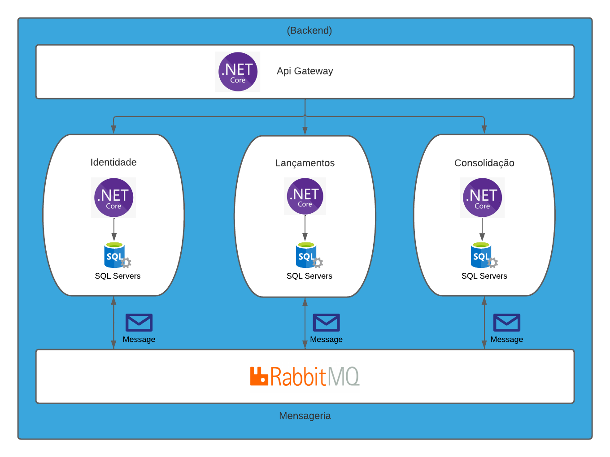

# Arquitetura




# Passos para executar o projeto
### 1 - Subir imagens
1. Com o Docker instalado, acessar a raiz do repositório e executar o comando no terminal: <code>docker-compose up</code>.
    
2. Verificar se as imagens <code>yia-rabbitmq</code>, <code>yia-sqlserver</code>, <code>yia-seq</code> estão rodando e suas respectivas portas.

3. A senha de acesso ao banco de dados é definido no arquivo <code>.env</code>, caso não seja alterada, por padrão será **senhaS3creta**.

### 2 - Configurar o Seq

1. Com a imagem <code>yia-seq</code> rodando, acessar o serviço do Seq pelo navegador (por padrão <code>http://localhost:5341/</code>).

2. No canto superior direito, clicar na imagem de perfil, ir em <code>API keys</code> e <code>ADD API KEY</code>.

3. Adicionar um título para sua API key (pode-se criar uma key e usar em todos os projetos, ou para melhor organização dos logs gerados, criar uma por projeto).

4. Clicar em <code>SAVE CHANGES</code> e copiar o api key token gerado para ser utilizado na configuração dos User Secrets.

### 3 - Configurar User Secrets

1. Com a solução aberta no Visual Studio, clicar com o botão direito nos projetos <code>Yia.UI</code>, <code>Yia.Cotacoes.API</code>, <code>Yia.ExecutorRobos</code>, <code>Yia.HangFire.API</code> selecionar <code>Manage User Secrets</code> e colar o seguinte código de configurações nos arquivos <code>secrets.json</code> abertos:

```json
{
  "ConnectionStrings": {
    "DefaultConnection": "Server=localhost;Database=Yia; UID=sa; PWD=senhaS3creta;"
  },
  "Serilog": {
    "MinimumLevel": {
      "Default": "Debug",
      "Override": {
        "Microsoft": "Warning"
      }
    },
    "WriteTo": [
      {
        "Name": "Seq",
        "Args": {
          "serverUrl": "http://localhost:5341/",
          "apiKey": "API_KEY_GERADA_NO_SEQ"
        }
      }
    ]
  }
}
```

2. O password definido na DefaultConnection será o definido no arquivo <code>.env</code> ao subir as imagens no passo anterior (por padrão **senhaS3creta**).

3. O parâmetro <code>"serverUrl"</code> deverá estar apontando para a porta onde está rodando o Seq (por padrão **5341**).

4. O parâmetro <code>"apiKey"</code> deverá ser a api key token gerada no Seq no passo anterior.

### 4 - Atualizar banco de dados (migrations)

1. No Visual Studio, definir o projeto <code>Yia.UI</code> como projeto de inicialização e realizar o build da solução.

2. Abrir o Package Manager Console e definir o projeto de destino como <code>4 - Infra\4.1 - Data\Yia.Infra.Data</code>.

4. No Package Manager Console, atualizar/criar o banco de dados com o comando <code>update-database</code>.

### 5 - Executar jobs HangFire

1. Na primeira execução da solução (diariamente), para atualizar a base de dados em relações a informações de serviços externos, é necessário executar os jobs do HangFire.

2. É necessário executar o projeto <code>Yia.HangFire.Api</code>, preferencialmente em modo self-hosting.

3. O acesso ao HangFire se dá através do caminho em que está executando o serviço (por padrão <code>https://localhost:7001/</code>), informando o login e senha definidos no <code>appsettings.json</code> do projeto (por padrão, login <code>admin</code> e senha <code>hangfirelyncas</code>).

4. Ir até a aba <code>Tarefas recorrentes</code>, selecionar todas tarefas e clicar em <code>Disparar agora</code>.

### 6 - Acesso ao RabbitMQ

1. O acesso ao RabbitMQ se dá pelo navegador na porta em que está disponível o serviço (por padrão <code>http://localhost:15672/</code>), com o usuário <code>guest</code> e senha <code>guest</code>.

### 7 - Executando o projeto
1. Com todos os demais passos anteriores realizados, para executar a solução é necessário apenas definir os projetos de 
<code>Yia.Ui</code>, <code>Yia.Cotacoes.Api</code>, <code>Yia.ExecutorRobos</code>, <code>Yia.HangFire.Api</code> como múltiplos projetos de inicialização.