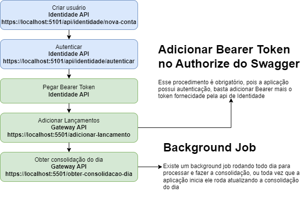

# Arquitetura

# Estrutura do Projeto:
Consolidacao.API - API de Consolidação.
Core - Central de funcionalidades comuns e compartilhadas.
Docker - Arquivos de configuração de contêineres Docker.
MessageBus - mensagens/eventos.
Gateway.API - Relacionado a uma API de Gateway.
Identidade.API - API relacionada à gestão de identidade.
Lancamento.API -  API relacionada aos lançamentos de crédito e débito.
WebApi.Core - Núcleo de funcionalidades para Web APIs.

# Resumo das Boas Práticas Aplicadas no Projeto

### Arquitetura Modular: 
O projeto está organizado em múltiplos serviços e APIs (Consolidacao.API, Gateway.API, Identidade.API, etc.), promovendo a separação de responsabilidades e facilitando a manutenção e a escalabilidade.
### Uso de Docker:
O projeto inclui arquivos de configuração Docker, permitindo a fácil replicação do ambiente de desenvolvimento e produção. Isso garante que todos os desenvolvedores e servidores estejam executando o mesmo ambiente, evitando problemas de "funciona na minha máquina".
### Migrações Automatizadas:
As migrações de banco de dados são configuradas para rodar automaticamente ao iniciar os serviços, assegurando que o banco de dados esteja sempre atualizado com a versão mais recente do modelo de dados.
### Gerenciamento de Mensagens com RabbitMQ:
A solução utiliza RabbitMQ para gerenciamento de mensagens e filas, o que é uma prática recomendada para sistemas distribuídos que requerem comunicação assíncrona entre serviços.

# Design Patterns
### Domain-Driven Design (DDD): 
Aplicado para organizar a lógica de negócios em torno de conceitos do domínio, garantindo que a estrutura da aplicação reflita as necessidades do negócio.
### Mediator Pattern: 
Utilizado para centralizar a comunicação entre componentes, promovendo um baixo acoplamento e facilitando a escalabilidade e manutenção da aplicação.
### Message Bus Pattern: 
Implementado para permitir comunicação assíncrona e desacoplada entre microservices, utilizando eventos e filas para garantir a resiliência do sistema.
### Repository Pattern: 
Abstrai o acesso a dados, fornecendo uma interface limpa e isolada das operações de persistência, facilitando a troca ou atualização de tecnologias de armazenamento.
### Specification Pattern: 
Utilizado para centralizar as regras de validação e consulta, tornando o código de negócio mais limpo e permitindo a reutilização de critérios complexos.
### Utility Pattern: 
Consolidado em uma biblioteca de utilidades (Utils), onde funcionalidades auxiliares e genéricas são centralizadas para evitar duplicação e promover a reutilização de código.
### Factory Pattern:
Possivelmente utilizado para a criação de instâncias complexas ou configuráveis, encapsulando a lógica de criação em classes específicas, promovendo a flexibilidade e a clareza do código.
### Singleton Pattern:
Pode ser aplicado para garantir que certas classes, como gerenciadores de configuração ou conexões de banco de dados, tenham apenas uma única instância durante o ciclo de vida da aplicação.
### Unit of Work Pattern: 
Utilizado para agrupar várias operações de banco de dados em uma única transação, garantindo que todas as alterações sejam aplicadas de forma atômica.
### Automated Testing (Testes Automatizados):
Implementação de testes automatizados para garantir que as funcionalidades do sistema sejam verificadas continuamente, promovendo qualidade e evitando regressões.
### Implementação do Padrão Command Query (CQS): 
CQS é implementado de forma que cada operação que altera o estado do sistema é tratada como um comando, enquanto as operações que apenas consultam os dados são tratadas como queries.

# Passos para executar o projeto
### 1 - Subir imagens
1. Com o Docker instalado, acessar a raiz do repositório e executar o comando no terminal: <code>docker-compose up</code>.
    
2. Verificar se as imagens <code>rabbitmq</code>, <code>sqlserver</code> estão rodando e suas respectivas portas.

3. A senha de acesso ao banco de dados é definido no arquivo <code>.env</code>.

4. Para levantar as instancias do rabbitmq e sqlserver para acessar a pasta docker e rodar o comando docker-compose up.

### 1 - Atualizar banco de dados (migrations)

1. Ao inicializar cada um dos micro serviços os mesmos devem rodar as migrations automaticamente criando as respectivas bases de dados:

A aplicação está utilizando o (localdb)\\mssqllocaldb, banco de dados local da microsoft.

Caso não ocorra a forma mencionada acima será necessário ir projeto a a projeto e rodar o comando <code>update-database</code> dentro do package manager console.

### 2 - Acesso ao RabbitMQ

1. O acesso ao RabbitMQ se dá pelo navegador na porta em que está disponível o serviço (por padrão <code>http://localhost:15672/</code>), com o usuário <code>guest</code> e senha <code>guest</code>.

### 3 - Executando o projeto
1. Com todos os demais passos anteriores realizados, para executar a solução é necessário apenas definir os projetos de 
<code>Gateway.API</code>, <code>Identidade.API</code>, <code>Lancamento.API</code>, <code>Consolidacao.API</code> como múltiplos projetos de inicialização.

Seguir o fluxo abaixo:

